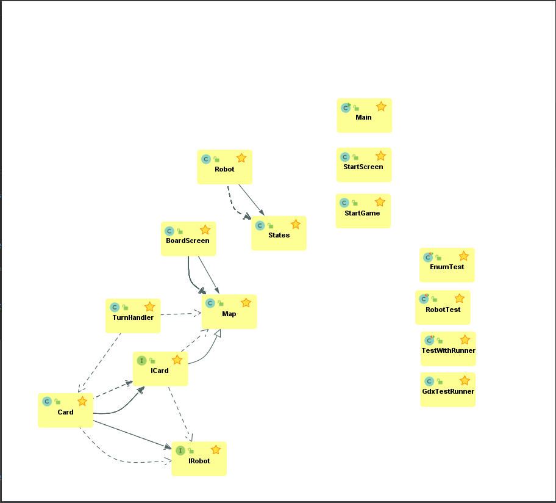

#Obligatorisk oppgave 3 
##Deloppgave 1: Team og prosjekt
- Referat fra møter siden forrige leveranse skal legges ved.
    
    
    Se Møtereferat.md i Deliverebles
    
- Hvordan fungerer rollene i teamet? Trenger dere å oppdatere hvem som er teamlead eller kundekontakt?

    Vi føler de fungerer bra, vi har merket at vi går etter styrker og vi
    utfyller hverandrer der vi trenger det.
    
- Er det noen erfaringer enten team-messig eller mtp prosjektmetodikk som er verdt å nevne? Synes teamet at de valgene dere har tatt er gode? Hvis ikke, hva kan dere gjøre annerledes for å forbedre måten teamet fungerer på?

    Det har vært litt uorden nå i det siste, med tanke på det som har skjedd de siste ukene.
    Men oppgave messig så har det gått gankse greit. 
    
- Gjør et kort retrospektiv hvor dere vurderer hva dere har klart til nå, og hva som kan forbedres. Dette skal handle om prosjektstruktur, ikke kode. Dere kan selvsagt diskutere kode, men dette handler ikke om feilretting, men om hvordan man jobber og kommuniserer.

    Nå er vi ferdig med grunn muren for oppgaven, og driver mer med det logiske i spillet, samt de litt mer avangserte tingene innen det grafiske, som kort og vise forskjellig kort når vi bytter robot. Men når vi ser tilbake på de siste ukene,
    så ser vi at komunikasjonen har vært dårlig. Vi ser også at det er mye som er gjort av en eller to personer i gruppa og andre får ikke gjort så mye.
    
- Bli enige om maks tre forbedringspunkter fra retrospektivet, som skal følges opp under neste sprint.

    
    Vi må bli bedre på å kommunisere
    og vi må bli bedre på å fordele arbeide mellom medlemmene
        
-Forklar kort hvordan dere har prioritert oppgavene fremover. Legg ved skjermdump av project board ved innlevering.

    Her vil vi prioritere å få til turnhandler, for når den er ferdig så vil resten av bitene komme litt etter hvert.
    Vi vil også se litt mere på testing og få skrevet en del nye tester til neste gang. 
    Vi har vært flinkere til å bruke trelle på denne innleveringen, men igjen så har vi latt den bli litt tom. dette er fordi at vi er flinke til å si ifra hva vi jobber med enten over direkte medlinge eller på slack. 
    Noen ganger så planlegger vi når en eller to skal gjøre store endringer på spillet, sånn at de andre ikke er inne på de klassene og gjør endringer som kan gjøre at vi får en merge feil. 
    Dette fører til at Trello blir litt ignorert til tider, men vi bruker det så godt som mulig.
    
    Gruppelederen vår har tilgang til Trelloen vår.
    
- Hvordan fungerer gruppedynamikken og kommunikasjonen?

    De siste ukene har det gått dårlig siden det har vært hjemmekontor og isolasjon. men vi skal fokusere på å få fikset dette fremover og få dette til å fungere bedre. 

##Deloppgave 2: Krav
- Oppdater hvilke krav dere har prioritert, hvor langt dere har kommet og hva dere har gjort siden forrige gang.
- For hvert krav dere jobber med, må dere lage
    1) ordentlige brukerhistorier, 
    2) akseptansekriterier og 
    3) arbeidsoppgaver.
    
  Husk at akseptansekriterier ofte skrives mer eller mindre som tester
- Dersom dere har oppgaver som dere skal til å starte med, hvor dere har oversikt over både brukerhistorie, akseptansekriterier og arbeidsoppgaver, kan dere ta med disse i innleveringen også.
- Forklar kort hvilke hovedkrav dere anser som en del av MVP og hvorfor. Hvis det er gjort endringer i rekkefølge utfra hva som er gitt fra kunde, hvorfor er dette gjort?
- Husk å skrive hvilke bugs som finnes i de kravene dere har utført (dersom det finnes bugs). 
- Kravlista er lang, men det er ikke nødvendig å levere på alle kravene hvis det ikke er realistisk. Det er viktigere at de oppgavene som er utført holder høy kvalitet. Utførte oppgaver skal være ferdige.

##Deloppgave 3: Produktleveranse og kodekvalitet
- Dere må dokumentere hvordan prosjektet bygger, testes og kjøres, slik at det er lett for gruppelderne å bygge, teste og kjøre koden deres. Under vurdering kommer koden også til å brukertestes.

    For å kjøre spillet så kan du bruke intellij, men så lenge du har lastet ned helle repoet, så skal dette gå fint. når du kjører så må du kjøre main klassen. du trenger ikke noe mer en dette. selve bygge koden blir gjort gjennom codacy og travis. disse tester også.
    Vi har tester som vi har lagd selv, her må du inn på test mappen og kjøre en av de med grønn og rød pil i hjørnet av C symbolet.
    
    Se README.md
    
    
- Prosjektet skal kunne bygge, testes og kjøres på Linux, Windows og OSX.

    
    Dette tester vi gjennom at vi har både linux, osx og window i gruppen.
    
- Lever klassediagram. (Hvis det er veldig mange klasser, lager dere for de viktigste.)

- Kodekvalitet og testdekning vektlegges. Merk at testene dere skriver skal brukes i produktet. Det kan være smart å skrive manuelle tester for å teste det som er grafisk.

    Se mappe test, også run, her ligger alle testen som vi har laget så langt.

- Utførte oppgaver skal være ferdige.

- Hvis dere tester manuelt: lever beskrivelser av hvordan testen foregår, slik at gruppeleder kan utføre testen selv.

- Under vurdering vil det vektlegges at alle bidrar til kodebasen. Hvis det er stor forskjell i hvem som committer, må dere legge ved en kort forklaring for hvorfor det er sånn. Husk å committe alt. (Også designfiler)

    Denne rundet så har vi prøvd å gjøre det sånn at alle leverer likt, men vi ser at det er noen av oss som har gjort litt mere enn andre. Dette er fordi at disse personene har som oppgave å kode, og de har hatt litt ekstra tid til å gjøre dette. 